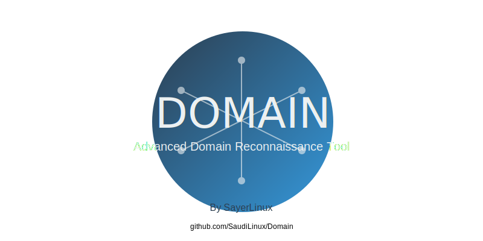

<div align="center">
  
  <h1>Domain Scanner</h1>
  <p>Advanced Domain Reconnaissance & Vulnerability Scanning Tool</p>
</div>

## Features

🔍 **Comprehensive Domain Information**
- IP addresses and DNS records
- WHOIS information
- SSL certificate details
- HTTP headers and technologies

🌐 **Subdomain Enumeration**
- Passive enumeration using multiple sources
- Active DNS enumeration
- Brute force discovery

🕷️ **Hidden URL Discovery**
- Web crawling with JavaScript execution
- Directory and file brute forcing
- Parameter discovery
- Modern SPA (Single Page Application) support

👑 **Admin Page Finder**
- Common admin panel detection
- Custom wordlist support
- Authentication bypass checks

🎯 **Attack Surface Management**
- Port scanning and service identification
- Security header analysis
- Technology stack detection
- CDN and WAF identification

🔒 **Advanced Vulnerability Scanner**
- SQL injection detection with extensive payload database
- Cross-site scripting (XSS) testing
- Local File Inclusion (LFI) vulnerabilities
- Command Injection testing
- Server-side request forgery (SSRF)
- Security misconfigurations
- API endpoint vulnerability testing

🛡️ **WAF Evasion & Anti-Detection**
- User-Agent rotation with real browser strings
- Randomized request delays
- Proxy support for traffic routing
- Headless browser automation to bypass JavaScript challenges
- Session cookie extraction and reuse

🤖 **Headless Browser Integration**
- Selenium WebDriver integration
- JavaScript execution capability
- Modern web application support
- Authenticated API testing
- Session management and cookie handling

📊 **Automated Reporting**
- Detailed markdown reports
- JSON export for automation
- Visual result presentation
- Vulnerability proof-of-concept results

## Installation

### Requirements
- Linux operating system
- Python 3.8 or higher
- pip package manager
- Chrome/Chromium browser (for headless mode)

### Steps

1. Clone the repository:
```bash
git clone https://github.com/SayerLinux/domain-scanner.git
cd domain-scanner
```

2. Install dependencies:
```bash
pip install -r requirements.txt
```

3. Install Chrome browser (if not already installed):
```bash
# For Ubuntu/Debian
sudo apt-get update
sudo apt-get install chromium-browser

# For other distributions, install Chrome or Chromium
```

## Usage

### Basic Scan
```bash
./domain.py -d example.com
```

### Full Scan with All Modules
```bash
./domain.py -d example.com --full
```

### Module-Specific Scans
```bash
# Domain Information
./domain.py -d example.com --info

# Subdomain Enumeration
./domain.py -d example.com --subdomains

# URL Discovery
./domain.py -d example.com --urls

# Admin Page Finding
./domain.py -d example.com --admin-finder

# Attack Surface Mapping
./domain.py -d example.com --attack-surface

# Vulnerability Scanning
./domain.py -d example.com --vulns
```

### Advanced Options

#### WAF Evasion & Anti-Detection
```bash
# Randomized delays (1-3 seconds random delay)
./domain.py -d example.com --full --delay "1-3"

# Custom User-Agent rotation
./domain.py -d example.com --full --user-agent "Mozilla/5.0 (Windows NT 10.0; Win64; x64) AppleWebKit/537.36"

# Proxy support
./domain.py -d example.com --full --proxy http://proxy.example.com:8080
```

#### Headless Browser Mode
```bash
# Enable headless browser for JavaScript-heavy sites
./domain.py -d example.com --full --headless

# Combine with WAF evasion
./domain.py -d example.com --full --headless --delay "1-3" --proxy http://proxy:8080
```

#### Performance Tuning
```bash
# Custom Thread Count
./domain.py -d example.com --full --threads 20

# Custom Timeout
./domain.py -d example.com --full --timeout 60

# Custom Wordlist
./domain.py -d example.com --full --wordlist /path/to/wordlist.txt
```

### Advanced Examples

#### Scanning Protected Targets (WAF Bypass)
```bash
# Full scan with WAF evasion techniques
./domain.py -d tayseerme.com --full --headless --delay "2-5" --threads 5
```

#### API Discovery and Testing
```bash
# Discover API endpoints with headless browser
./domain.py -d example.com --urls --headless --vulns
```

#### Stealth Scanning
```bash
# Low and slow approach with proxy
./domain.py -d example.com --full --headless --delay "3-7" --proxy http://proxy:8080 --threads 2
```

## Output

Results are saved in the `results` directory with the following format:
- Markdown Report: `domain_YYYYMMDD_HHMMSS.md`
- JSON Data: `domain_YYYYMMDD_HHMMSS.json`
- Log Files: `domain_YYYYMMDD_HHMMSS.log`

### Report Contents
- Domain information and DNS records
- Discovered subdomains
- Hidden URLs and endpoints
- Admin panels and login pages
- Open ports and services
- Vulnerability findings with severity ratings
- Technology stack identification
- Security header analysis
- API endpoints and parameters

## Advanced Features

### Headless Browser Integration
The tool can use Selenium WebDriver to interact with modern web applications that require JavaScript execution. This allows:
- Bypassing client-side security checks
- Discovering dynamically generated content
- Testing single-page applications (SPAs)
- Extracting session cookies for authenticated testing

### WAF Evasion Techniques
- **User-Agent Rotation**: Automatically cycles through realistic browser User-Agent strings
- **Randomized Delays**: Introduces variable delays between requests (e.g., "1-3" for 1-3 second random delays)
- **Proxy Support**: Routes traffic through proxy servers to mask source IP
- **Session Management**: Extracts and reuses authentication cookies

### Vulnerability Testing
The scanner includes comprehensive payload databases for:
- SQL Injection (SQLi) with error-based and blind techniques
- Cross-Site Scripting (XSS) with various payload types
- Local File Inclusion (LFI) with path traversal attempts
- Command Injection with shell command payloads
- Server-Side Request Forgery (SSRF) with URL manipulation
- Security misconfiguration detection

## Troubleshooting

### Headless Browser Issues
If you encounter issues with headless mode:
1. Ensure Chrome/Chromium is installed
2. Check that the ChromeDriver version matches your Chrome version
3. Try running with `--no-sandbox` flag if permissions issues occur

### WAF Detection
If scans are being blocked:
1. Use `--headless` mode for better evasion
2. Increase delay range (e.g., `--delay "3-7"`)
3. Use proxy servers with `--proxy`
4. Reduce thread count with `--threads 2`

### Performance Optimization
For large targets:
1. Use specific modules instead of `--full`
2. Adjust thread count based on target response
3. Use appropriate timeout values
4. Consider using proxy rotation for distributed scanning

## Security Considerations

- Always obtain proper authorization before scanning
- Respect rate limits and server resources
- Use responsibly and ethically
- Be aware of legal implications in your jurisdiction
- Consider using VPN or proxy services for anonymity

## Disclaimer

This tool is intended for legal security testing and research purposes only. Users must obtain proper authorization before scanning any domains they don't own. The author is not responsible for any misuse or damage caused by this tool.

## Author

**SayerLinux**
- Email: SayerLinux@gmail.com

## License

This project is licensed under the MIT License - see the [LICENSE](LICENSE) file for details.