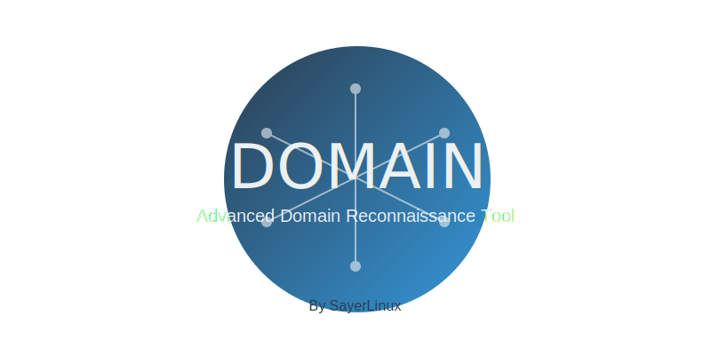

<div align="center">
  
  <h1>Domain Scanner</h1>
  <p>Advanced Domain Reconnaissance Tool</p>
</div>

## Features

🔍 **Comprehensive Domain Information**
- IP addresses and DNS records
- WHOIS information
- SSL certificate details
- HTTP headers and technologies

🌐 **Subdomain Enumeration**
- Passive enumeration using multiple sources
- Active DNS enumeration
- Brute force discovery

🕷️ **Hidden URL Discovery**
- Web crawling
- Directory and file brute forcing
- Parameter discovery

👑 **Admin Page Finder**
- Common admin panel detection
- Custom wordlist support
- Authentication bypass checks

🎯 **Attack Surface Management**
- Port scanning and service identification
- Security header analysis
- Technology stack detection
- CDN and WAF identification

🔒 **Vulnerability Scanner**
- SQL injection detection
- Cross-site scripting (XSS)
- File inclusion vulnerabilities
- Server-side request forgery (SSRF)
- Security misconfigurations

📊 **Automated Reporting**
- Detailed markdown reports
- JSON export for automation
- Visual result presentation

## Installation

### Requirements
- Linux operating system
- Python 3.8 or higher
- pip package manager

### Steps

1. Clone the repository:
```bash
git clone https://github.com/SayerLinux/domain-scanner.git
cd domain-scanner
```

2. Install dependencies:
```bash
pip install -r requirements.txt
```

## Usage

### Basic Scan
```bash
./domain.py -d example.com
```

### Full Scan with All Modules
```bash
./domain.py -d example.com --full
```

### Module-Specific Scans
```bash
# Domain Information
./domain.py -d example.com --info

# Subdomain Enumeration
./domain.py -d example.com --subdomains

# URL Discovery
./domain.py -d example.com --urls

# Admin Page Finding
./domain.py -d example.com --admin-finder

# Attack Surface Mapping
./domain.py -d example.com --attack-surface

# Vulnerability Scanning
./domain.py -d example.com --vulns
```

### Advanced Options
```bash
# Custom Thread Count
./domain.py -d example.com --full --threads 20

# Custom Timeout
./domain.py -d example.com --full --timeout 60

# Custom Wordlist
./domain.py -d example.com --full --wordlist /path/to/wordlist.txt

# Custom User-Agent
./domain.py -d example.com --full --user-agent "Mozilla/5.0"

# Request Delay
./domain.py -d example.com --full --delay 1.0
```

## Output

Results are saved in the `results` directory with the following format:
- Markdown Report: `domain_YYYYMMDD_HHMMSS.md`
- JSON Data: `domain_YYYYMMDD_HHMMSS.json`

## Disclaimer

This tool is intended for legal security testing and research purposes only. Users must obtain proper authorization before scanning any domains they don't own. The author is not responsible for any misuse or damage caused by this tool.

## Author

**SayerLinux**
- Email: SayerLinux@gmail.com

## License

This project is licensed under the MIT License - see the [LICENSE](LICENSE) file for details.